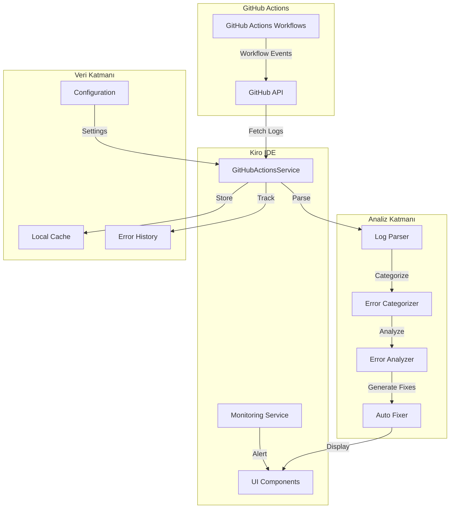

# Design Document

## Overview

GitHub Actions Hata Tespiti ve Otomatik Düzeltme sistemi, CI/CD pipeline'larında
oluşan hataları otomatik olarak tespit edip analiz eden ve geliştiricilere
anlaşılır çözüm önerileri sunan kapsamlı bir araçtır. Sistem, mevcut GitHub
Actions workflow'larını (ci.yml, cloudflare.yml, quality.yml) izler, hataları
kategorize eder ve otomatik düzeltme önerileri sunar.

### Temel Özellikler

- **Otomatik Hata Tespiti**: GitHub Actions API'si üzerinden workflow
  çalıştırmalarını izleme
- **Akıllı Kategorilendirme**: Hataları lint, type-check, build, deploy ve
  security kategorilerine ayırma
- **Düzeltme Önerileri**: Her hata türü için spesifik, uygulanabilir çözüm
  önerileri
- **Workflow Validasyonu**: Workflow dosyalarının yapılandırma kontrolü
- **Hata İzleme**: Geçmiş hataları ve trendleri takip etme
- **IDE Entegrasyonu**: Kiro IDE içinden hata yönetimi

## Architecture

### Sistem Mimarisi



### Veri Akışı

1. **Hata Tespiti**: GitHub Actions API'den workflow çalıştırmaları çekilir
2. **Log Parsing**: Hata logları parse edilir ve yapılandırılmış formata
   dönüştürülür
3. **Kategorilendirme**: Hatalar türlerine göre sınıflandırılır
4. **Analiz**: Her hata detaylı olarak analiz edilir
5. **Çözüm Üretimi**: Otomatik düzeltme önerileri oluşturulur
6. **Sunum**: Sonuçlar IDE içinde kullanıcıya gösterilir

## Components and Interfaces

### 1. GitHubActionsService

Ana servis katmanı, GitHub API ile iletişimi yönetir.

```typescript
// services/githubActionsService.ts

export interface GitHubActionsConfig {
  owner: string;
  repo: string;
  token: string;
  branch?: string;
}

export interface WorkflowRun {
  id: number;
  name: string;
  status: 'queued' | 'in_progress' | 'completed';
  conclusion: 'success' | 'failure' | 'cancelled' | 'skipped' | null;
  workflow_id: number;
  created_at: string;
  updated_at: string;
  html_url: string;
  jobs_url: string;
  logs_url: string;
}

export interface WorkflowJob {
  id: number;
  run_id: number;
  name: string;
  status: string;
  conclusion: string | null;
  started_at: string;
  completed_at: string | null;
  steps: WorkflowStep[];
}

export interface WorkflowStep {
  name: string;
  status: string;
  conclusion: string | null;
  number: number;
  started_at: string;
  completed_at: string | null;
}

class GitHubActionsService {
  private config: GitHubActionsConfig;
  private cache: Map<string, any>;

  constructor(config: GitHubActionsConfig);

  // Workflow çalıştırmalarını getir
  async getWorkflowRuns(workflowId?: string): Promise<WorkflowRun[]>;

  // Belirli bir çalıştırmanın detaylarını getir
  async getWorkflowRun(runId: number): Promise<WorkflowRun>;

  // Çalıştırmanın job'larını getir
  async getWorkflowJobs(runId: number): Promise<WorkflowJob[]>;

  // Çalıştırmanın loglarını getir
  async getWorkflowLogs(runId: number): Promise<string>;

  // Başarısız çalıştırmaları getir
  async getFailedRuns(limit?: number): Promise<WorkflowRun[]>;

  // Workflow'u yeniden çalıştır
  async rerunWorkflow(runId: number): Promise<void>;
}
```

### 2. ErrorParser

Log dosyalarını parse eder ve hataları çıkarır.

```typescript
// services/githubActions/errorParser.ts

export interface ParsedError {
  type: ErrorType;
  message: string;
  file?: string;
  line?: number;
  column?: number;
  rule?: string;
  severity: 'error' | 'warning' | 'info';
  rawLog: string;
  context?: string[];
}

export enum ErrorType {
  ESLINT = 'eslint',
  TYPESCRIPT = 'typescript',
  BUILD = 'build',
  DEPLOY = 'deploy',
  SECURITY = 'security',
  TEST = 'test',
  DEPENDENCY = 'dependency',
  CONFIGURATION = 'configuration',
  UNKNOWN = 'unknown',
}

class ErrorParser {
  // Ana parse fonksiyonu
  parse(logs: string): ParsedError[];

  // ESLint hatalarını parse et
  private parseESLintErrors(logs: string): ParsedError[];

  // TypeScript hatalarını parse et
  private parseTypeScriptErrors(logs: string): ParsedError[];

  // Build hatalarını parse et
  private parseBuildErrors(logs: string): ParsedError[];

  // Cloudflare deploy hatalarını parse et
  private parseCloudflareErrors(logs: string): ParsedError[];

  // Security audit hatalarını parse et
  private parseSecurityErrors(logs: string): ParsedError[];

  // Hata tipini belirle
  private detectErrorType(log: string): ErrorType;

  // Dosya ve satır numarasını çıkar
  private extractFileLocation(log: string): {
    file?: string;
    line?: number;
    column?: number;
  };
}
```

### 3. ErrorAnalyzer

Hataları analiz eder ve kategorize eder.

```typescript
// services/githubActions/errorAnalyzer.ts

export interface ErrorAnalysis {
  error: ParsedError;
  category: ErrorCategory;
  priority: number;
  impact: 'low' | 'medium' | 'high' | 'critical';
  fixable: boolean;
  relatedErrors: ParsedError[];
  suggestions: FixSuggestion[];
}

export enum ErrorCategory {
  CODE_QUALITY = 'code_quality',
  TYPE_SAFETY = 'type_safety',
  BUILD_FAILURE = 'build_failure',
  DEPLOYMENT = 'deployment',
  SECURITY_VULNERABILITY = 'security_vulnerability',
  CONFIGURATION = 'configuration',
  DEPENDENCY = 'dependency',
}

export interface FixSuggestion {
  title: string;
  description: string;
  command?: string;
  autoFixable: boolean;
  estimatedTime: string;
  steps?: string[];
}

class ErrorAnalyzer {
  // Hataları analiz et
  analyze(errors: ParsedError[]): ErrorAnalysis[];

  // Hata kategorisini belirle
  private categorizeError(error: ParsedError): ErrorCategory;

  // Hata önceliğini hesapla
  private calculatePriority(error: ParsedError): number;

  // Hata etkisini değerlendir
  private assessImpact(
    error: ParsedError,
  ): 'low' | 'medium' | 'high' | 'critical';

  // İlişkili hataları bul
  private findRelatedErrors(
    error: ParsedError,
    allErrors: ParsedError[],
  ): ParsedError[];

  // Düzeltme önerileri oluştur
  private generateSuggestions(error: ParsedError): FixSuggestion[];
}
```

### 4. AutoFixer

Otomatik düzeltme işlemlerini yönetir.

```typescript
// services/githubActions/autoFixer.ts

export interface FixResult {
  success: boolean;
  error?: ParsedError;
  appliedFix?: FixSuggestion;
  message: string;
  filesModified?: string[];
  commandsExecuted?: string[];
}

export interface FixOptions {
  dryRun?: boolean;
  autoCommit?: boolean;
  commitMessage?: string;
}

class AutoFixer {
  // Otomatik düzeltme uygula
  async applyFix(
    error: ParsedError,
    suggestion: FixSuggestion,
    options?: FixOptions,
  ): Promise<FixResult>;

  // Birden fazla hatayı düzelt
  async applyBulkFixes(
    analyses: ErrorAnalysis[],
    options?: FixOptions,
  ): Promise<FixResult[]>;

  // ESLint hatalarını düzelt
  private async fixESLintErrors(errors: ParsedError[]): Promise<FixResult[]>;

  // Format hatalarını düzelt
  private async fixFormatErrors(errors: ParsedError[]): Promise<FixResult[]>;

  // Bağımlılık hatalarını düzelt
  private async fixDependencyErrors(
    errors: ParsedError[],
  ): Promise<FixResult[]>;

  // Komut çalıştır
  private async executeCommand(
    command: string,
  ): Promise<{ stdout: string; stderr: string }>;

  // Değişiklikleri commit et
  private async commitChanges(message: string, files: string[]): Promise<void>;
}
```

### 5. WorkflowValidator

Workflow dosyalarını validate eder.

```typescript
// services/githubActions/workflowValidator.ts

export interface ValidationResult {
  valid: boolean;
  errors: ValidationError[];
  warnings: ValidationWarning[];
  suggestions: string[];
}

export interface ValidationError {
  file: string;
  message: string;
  line?: number;
  severity: 'error' | 'warning';
}

export interface ValidationWarning {
  file: string;
  message: string;
  suggestion?: string;
}

export interface WorkflowConfig {
  requiredSecrets: string[];
  requiredEnvVars: string[];
  nodeVersion: string;
}

class WorkflowValidator {
  // Workflow dosyasını validate et
  async validateWorkflow(workflowPath: string): Promise<ValidationResult>;

  // Tüm workflow dosyalarını validate et
  async validateAllWorkflows(): Promise<Map<string, ValidationResult>>;

  // Secret'ları kontrol et
  private validateSecrets(
    workflow: any,
    config: WorkflowConfig,
  ): ValidationError[];

  // Environment variable'ları kontrol et
  private validateEnvVars(
    workflow: any,
    config: WorkflowConfig,
  ): ValidationError[];

  // Node.js versiyonunu kontrol et
  private validateNodeVersion(
    workflow: any,
    config: WorkflowConfig,
  ): ValidationError[];

  // Cloudflare yapılandırmasını kontrol et
  private validateCloudflareConfig(workflow: any): ValidationError[];

  // Continue-on-error kullanımını kontrol et
  private checkContinueOnError(workflow: any): ValidationWarning[];
}
```

### 6. ErrorHistoryService

Hata geçmişini yönetir.

```typescript
// services/githubActions/errorHistoryService.ts

export interface ErrorRecord {
  id: string;
  timestamp: Date;
  workflowRun: WorkflowRun;
  errors: ParsedError[];
  analyses: ErrorAnalysis[];
  fixes: FixResult[];
  resolved: boolean;
  resolvedAt?: Date;
}

export interface ErrorStats {
  totalErrors: number;
  errorsByType: Record<ErrorType, number>;
  errorsByCategory: Record<ErrorCategory, number>;
  mostCommonErrors: Array<{ error: string; count: number }>;
  averageResolutionTime: number;
  fixSuccessRate: number;
}

class ErrorHistoryService {
  // Hata kaydı ekle
  async addRecord(
    record: Omit<ErrorRecord, 'id' | 'timestamp'>,
  ): Promise<ErrorRecord>;

  // Hata geçmişini getir
  async getHistory(limit?: number): Promise<ErrorRecord[]>;

  // Belirli bir hatayı getir
  async getRecord(id: string): Promise<ErrorRecord | null>;

  // Hata istatistiklerini getir
  async getStats(period?: { start: Date; end: Date }): Promise<ErrorStats>;

  // Benzer hataları bul
  async findSimilarErrors(error: ParsedError): Promise<ErrorRecord[]>;

  // Hatayı çözüldü olarak işaretle
  async markResolved(id: string): Promise<void>;

  // Geçmişi temizle
  async clearHistory(olderThan?: Date): Promise<void>;
}
```

## Data Models

### Local Storage Schema

```typescript
// types/githubActions.ts

export interface GitHubActionsState {
  config: GitHubActionsConfig;
  recentRuns: WorkflowRun[];
  errorHistory: ErrorRecord[];
  cache: {
    workflows: Map<string, WorkflowRun>;
    jobs: Map<number, WorkflowJob[]>;
    logs: Map<number, string>;
  };
  settings: {
    autoFetch: boolean;
    fetchInterval: number;
    notificationsEnabled: boolean;
    autoFixEnabled: boolean;
  };
}
```

### Cache Strategy

```typescript
// Cache yapılandırması
const CACHE_CONFIG = {
  workflows: {
    ttl: 5 * 60 * 1000, // 5 dakika
    maxSize: 50,
  },
  jobs: {
    ttl: 10 * 60 * 1000, // 10 dakika
    maxSize: 100,
  },
  logs: {
    ttl: 30 * 60 * 1000, // 30 dakika
    maxSize: 20,
  },
};
```

## Error Handling

### Hata Kategorileri ve Çözümleri

#### 1. ESLint Hataları

```typescript
const ESLINT_FIXES = {
  'no-unused-vars': {
    command: 'npm run lint:fix',
    autoFixable: true,
    description: 'Kullanılmayan değişkenleri otomatik olarak kaldır',
  },
  'no-console': {
    command: 'npm run lint:fix',
    autoFixable: true,
    description: 'console.log ifadelerini logger ile değiştir',
  },
  '@typescript-eslint/no-explicit-any': {
    command: null,
    autoFixable: false,
    description: 'any tipini spesifik tip ile değiştir',
    steps: [
      'Değişkenin kullanımını incele',
      'Uygun tip tanımını belirle',
      'any yerine spesifik tip kullan',
    ],
  },
};
```

#### 2. TypeScript Hataları

```typescript
const TYPESCRIPT_FIXES = {
  TS2304: {
    // Cannot find name
    description: 'Eksik import veya tip tanımı',
    steps: [
      'İlgili tipin import edildiğinden emin ol',
      'Tip tanımının mevcut olduğunu kontrol et',
      'Gerekirse @types paketini yükle',
    ],
  },
  TS2345: {
    // Argument type mismatch
    description: 'Parametre tip uyumsuzluğu',
    steps: [
      'Beklenen tip ile gönderilen tipi karşılaştır',
      'Gerekirse tip dönüşümü yap',
      'Fonksiyon imzasını kontrol et',
    ],
  },
};
```

#### 3. Build Hataları

```typescript
const BUILD_FIXES = {
  MODULE_NOT_FOUND: {
    command: 'npm install',
    autoFixable: true,
    description: 'Eksik bağımlılıkları yükle',
  },
  VITE_BUILD_ERROR: {
    description: 'Vite build hatası',
    steps: [
      'dist/ klasörünü temizle',
      "node_modules/.vite cache'ini temizle",
      'npm run clean && npm install',
      'npm run build',
    ],
  },
};
```

#### 4. Cloudflare Deploy Hataları

```typescript
const CLOUDFLARE_FIXES = {
  INVALID_API_TOKEN: {
    description: 'Geçersiz Cloudflare API token',
    steps: [
      "Cloudflare dashboard'dan yeni API token oluştur",
      "GitHub Secrets'a CLOUDFLARE_API_TOKEN ekle",
      "Token'ın doğru izinlere sahip olduğunu kontrol et",
    ],
  },
  PROJECT_NOT_FOUND: {
    description: 'Cloudflare Pages projesi bulunamadı',
    steps: [
      "Cloudflare Pages'de proje adını kontrol et",
      'workflow dosyasında projectName değerini güncelle',
      "Account ID'nin doğru olduğunu kontrol et",
    ],
  },
  BUILD_OUTPUT_MISSING: {
    description: 'Build output klasörü bulunamadı',
    steps: [
      'Build komutunun başarılı çalıştığını kontrol et',
      'dist/ klasörünün oluşturulduğunu doğrula',
      'directory parametresinin doğru olduğunu kontrol et',
    ],
  },
};
```

### Error Recovery Stratejileri

```typescript
class ErrorRecoveryStrategy {
  // Otomatik retry mekanizması
  async retryWithBackoff(
    fn: () => Promise<any>,
    maxRetries: number = 3,
    baseDelay: number = 1000,
  ): Promise<any>;

  // Fallback stratejisi
  async withFallback<T>(
    primary: () => Promise<T>,
    fallback: () => Promise<T>,
  ): Promise<T>;

  // Circuit breaker pattern
  async withCircuitBreaker<T>(
    fn: () => Promise<T>,
    threshold: number = 5,
  ): Promise<T>;
}
```

## Testing Strategy

### Unit Tests

```typescript
// tests/services/githubActions/errorParser.test.ts
describe('ErrorParser', () => {
  describe('parseESLintErrors', () => {
    it('should parse ESLint errors correctly', () => {
      const logs = `
        /path/to/file.ts
          10:5  error  'foo' is defined but never used  no-unused-vars
      `;
      const errors = parser.parse(logs);
      expect(errors).toHaveLength(1);
      expect(errors[0].type).toBe(ErrorType.ESLINT);
      expect(errors[0].rule).toBe('no-unused-vars');
    });
  });

  describe('parseTypeScriptErrors', () => {
    it('should parse TypeScript errors correctly', () => {
      const logs = `
        src/file.ts:15:10 - error TS2304: Cannot find name 'Foo'.
      `;
      const errors = parser.parse(logs);
      expect(errors).toHaveLength(1);
      expect(errors[0].type).toBe(ErrorType.TYPESCRIPT);
    });
  });
});
```

### Integration Tests

```typescript
// tests/services/githubActions/integration.test.ts
describe('GitHubActions Integration', () => {
  it('should fetch and analyze failed workflow runs', async () => {
    const service = new GitHubActionsService(config);
    const runs = await service.getFailedRuns(5);

    expect(runs.length).toBeGreaterThan(0);

    const logs = await service.getWorkflowLogs(runs[0].id);
    const errors = parser.parse(logs);
    const analyses = analyzer.analyze(errors);

    expect(analyses.length).toBeGreaterThan(0);
    expect(analyses[0].suggestions.length).toBeGreaterThan(0);
  });
});
```

### E2E Tests

```typescript
// tests/e2e/githubActions.spec.ts
test('complete error detection and fix workflow', async ({ page }) => {
  // GitHub Actions panelini aç
  await page.click('[data-testid="github-actions-panel"]');

  // Başarısız workflow'ları göster
  await page.click('[data-testid="show-failed-runs"]');

  // İlk hatayı seç
  await page.click('[data-testid="error-item-0"]');

  // Düzeltme önerilerini göster
  await expect(page.locator('[data-testid="fix-suggestions"]')).toBeVisible();

  // Otomatik düzeltme uygula
  await page.click('[data-testid="apply-auto-fix"]');

  // Başarı mesajını kontrol et
  await expect(page.locator('[data-testid="fix-success"]')).toBeVisible();
});
```

## UI Components

### 1. GitHubActionsPanel

Ana panel komponenti.

```typescript
// components/githubActions/GitHubActionsPanel.tsx
interface GitHubActionsPanelProps {
  config: GitHubActionsConfig;
  onConfigChange: (config: GitHubActionsConfig) => void;
}

export const GitHubActionsPanel: React.FC<GitHubActionsPanelProps> = ({
  config,
  onConfigChange
}) => {
  return (
    <div className="github-actions-panel">
      <WorkflowRunsList />
      <ErrorAnalysisView />
      <FixSuggestionsPanel />
      <ErrorHistoryView />
    </div>
  );
};
```

### 2. WorkflowRunsList

Workflow çalıştırmalarını listeler.

```typescript
// components/githubActions/WorkflowRunsList.tsx
interface WorkflowRunsListProps {
  runs: WorkflowRun[];
  onSelectRun: (run: WorkflowRun) => void;
  filter?: 'all' | 'failed' | 'success';
}

export const WorkflowRunsList: React.FC<WorkflowRunsListProps> = ({
  runs,
  onSelectRun,
  filter = 'all'
}) => {
  const filteredRuns = useMemo(() => {
    if (filter === 'all') return runs;
    return runs.filter(run =>
      filter === 'failed'
        ? run.conclusion === 'failure'
        : run.conclusion === 'success'
    );
  }, [runs, filter]);

  return (
    <div className="workflow-runs-list">
      {filteredRuns.map(run => (
        <WorkflowRunItem
          key={run.id}
          run={run}
          onClick={() => onSelectRun(run)}
        />
      ))}
    </div>
  );
};
```

### 3. ErrorAnalysisView

Hata analizlerini gösterir.

```typescript
// components/githubActions/ErrorAnalysisView.tsx
interface ErrorAnalysisViewProps {
  analyses: ErrorAnalysis[];
  onSelectError: (analysis: ErrorAnalysis) => void;
}

export const ErrorAnalysisView: React.FC<ErrorAnalysisViewProps> = ({
  analyses,
  onSelectError
}) => {
  const groupedByCategory = useMemo(() => {
    return analyses.reduce((acc, analysis) => {
      const category = analysis.category;
      if (!acc[category]) acc[category] = [];
      acc[category].push(analysis);
      return acc;
    }, {} as Record<ErrorCategory, ErrorAnalysis[]>);
  }, [analyses]);

  return (
    <div className="error-analysis-view">
      {Object.entries(groupedByCategory).map(([category, errors]) => (
        <ErrorCategorySection
          key={category}
          category={category as ErrorCategory}
          errors={errors}
          onSelectError={onSelectError}
        />
      ))}
    </div>
  );
};
```

### 4. FixSuggestionsPanel

Düzeltme önerilerini gösterir.

```typescript
// components/githubActions/FixSuggestionsPanel.tsx
interface FixSuggestionsPanelProps {
  analysis: ErrorAnalysis;
  onApplyFix: (suggestion: FixSuggestion) => Promise<void>;
}

export const FixSuggestionsPanel: React.FC<FixSuggestionsPanelProps> = ({
  analysis,
  onApplyFix
}) => {
  const [applying, setApplying] = useState(false);

  const handleApplyFix = async (suggestion: FixSuggestion) => {
    setApplying(true);
    try {
      await onApplyFix(suggestion);
      toast.success('Düzeltme başarıyla uygulandı');
    } catch (error) {
      toast.error('Düzeltme uygulanırken hata oluştu');
    } finally {
      setApplying(false);
    }
  };

  return (
    <div className="fix-suggestions-panel">
      <h3>Düzeltme Önerileri</h3>
      {analysis.suggestions.map((suggestion, index) => (
        <FixSuggestionCard
          key={index}
          suggestion={suggestion}
          onApply={() => handleApplyFix(suggestion)}
          disabled={applying}
        />
      ))}
    </div>
  );
};
```

## Performance Considerations

### Optimizasyon Stratejileri

1. **API Rate Limiting**: GitHub API rate limit'lerini yönetme
2. **Caching**: Workflow ve log verilerini cache'leme
3. **Lazy Loading**: Büyük log dosyalarını parça parça yükleme
4. **Debouncing**: Otomatik fetch işlemlerini debounce etme
5. **Virtual Scrolling**: Uzun hata listelerinde virtual scrolling kullanma

```typescript
// Performance optimizasyonları
const PERFORMANCE_CONFIG = {
  api: {
    maxConcurrentRequests: 3,
    requestTimeout: 30000,
    retryAttempts: 3,
    rateLimitBuffer: 10, // API limit'e 10 istek kala dur
  },
  cache: {
    enabled: true,
    strategy: 'lru',
    maxSize: 100,
    ttl: 300000, // 5 dakika
  },
  ui: {
    virtualScrollThreshold: 50,
    lazyLoadChunkSize: 20,
    debounceDelay: 500,
  },
};
```

## Security Considerations

### Güvenlik Önlemleri

1. **Token Güvenliği**: GitHub token'ları güvenli şekilde saklama
2. **Log Sanitization**: Hassas bilgileri loglardan temizleme
3. **Command Injection**: Komut enjeksiyonunu önleme
4. **Access Control**: Sadece yetkili kullanıcıların erişimi

```typescript
// Güvenlik yapılandırması
const SECURITY_CONFIG = {
  token: {
    storage: 'encrypted', // Token'ları şifreli sakla
    rotation: true, // Token rotasyonu
    expiryCheck: true, // Token geçerliliğini kontrol et
  },
  logs: {
    sanitize: true, // Hassas bilgileri temizle
    patterns: [
      /token[=:]\s*[\w-]+/gi,
      /password[=:]\s*\S+/gi,
      /api[_-]?key[=:]\s*[\w-]+/gi,
    ],
  },
  commands: {
    whitelist: [
      'npm run lint:fix',
      'npm run format',
      'npm install',
      'npm audit fix',
    ],
    validation: true, // Komutları validate et
  },
};
```

## Integration Points

### Mevcut Sistemle Entegrasyon

1. **Monitoring Service**: Hata tracking için mevcut monitoring servisi
   kullanımı
2. **Notification Service**: Hata bildirimleri için notification servisi
   entegrasyonu
3. **File Storage**: Hata loglarını saklamak için file storage servisi
4. **Cache Service**: Performans için cache servisi kullanımı

```typescript
// Entegrasyon örnekleri
import { monitoring } from '@/services/monitoringService';
import { notificationService } from '@/services/notificationService';
import { cachingService } from '@/services/cachingService';

// Hata tracking
monitoring.trackError('github_actions_error', {
  workflowId: run.workflow_id,
  runId: run.id,
  errorType: error.type,
});

// Bildirim gönder
await notificationService.send({
  type: 'error',
  title: 'GitHub Actions Hatası',
  message: `${run.name} workflow'u başarısız oldu`,
  data: { runId: run.id },
});

// Cache kullanımı
const cachedLogs = await cachingService.get(`workflow_logs_${runId}`);
if (!cachedLogs) {
  const logs = await fetchLogs(runId);
  await cachingService.set(`workflow_logs_${runId}`, logs, { ttl: 300000 });
}
```

## Deployment Strategy

### Aşamalı Dağıtım

1. **Phase 1**: Temel hata tespiti ve görüntüleme
2. **Phase 2**: Hata analizi ve kategorilendirme
3. **Phase 3**: Otomatik düzeltme önerileri
4. **Phase 4**: Workflow validasyonu
5. **Phase 5**: Hata geçmişi ve raporlama

### Feature Flags

```typescript
const FEATURE_FLAGS = {
  errorDetection: true,
  errorAnalysis: true,
  autoFix: false, // Başlangıçta kapalı
  workflowValidation: true,
  errorHistory: true,
  notifications: true,
};
```
