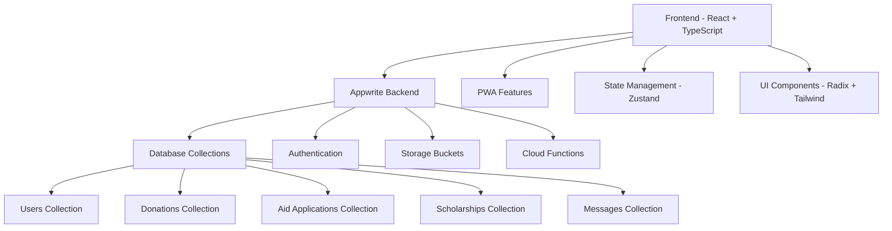

# 📚 Dernek Yönetim Sistemi - Dokümantasyon

## 🎯 Hoş Geldiniz

Bu dokümantasyon, **Dernek Yönetim Sistemi** projesinin tüm yönlerini kapsar. Proje, kar amacı gütmeyen dernekler için modern, kapsamlı bir yönetim çözümü sunar.

## 📖 Dokümantasyon İçeriği

### 🏠 [Ana Sayfa](./README.md)
- Proje genel bakışı
- Teknoloji stack'i
- Kurulum rehberi
- Proje yapısı

### 📡 [API Dokümantasyonu](./api.md)
- Authentication endpoints
- Kullanıcı yönetimi API'leri
- Bağış yönetimi API'leri
- Yardım yönetimi API'leri
- Burs yönetimi API'leri
- Fon yönetimi API'leri
- Mesajlaşma API'leri
- Dashboard istatistikleri
- Hata kodları ve response formatları

### 🚀 [Deployment Rehberi](./deployment.md)
- Production deployment süreci
- Vercel, Netlify, GitHub Pages seçenekleri
- Appwrite production kurulumu
- CI/CD pipeline
- Security checklist
- PWA deployment
- Troubleshooting

## 🏗️ Proje Mimarisi



## 🎯 Ana Özellikler

### 💰 Bağış Yönetimi
- Nakit, ayni ve hizmet bağışları
- Bağışçı bilgileri yönetimi
- Bağış raporları ve analizleri
- Kumbara takibi

### 🤝 Yardım Yönetimi
- İhtiyaç sahipleri kayıt sistemi
- Yardım başvuru süreci
- Doküman yükleme ve onay süreci
- Nakit yardım dağıtımı

### 🎓 Burs Yönetimi
- Öğrenci kayıt sistemi
- Burs başvuru süreci
- Yetim öğrenci takibi
- Burs ödemeleri yönetimi

### 💼 Fon Yönetimi
- Gelir-gider takibi
- Finansal raporlar
- Bütçe planlama
- Muhasebe entegrasyonu

### 💬 Mesajlaşma
- Kurum içi iletişim
- Toplu mesaj gönderimi
- Dosya paylaşımı
- Bildirim sistemi

### 👥 Kullanıcı Yönetimi
- Rol bazlı yetkilendirme
- Kullanıcı profilleri
- Yetki yönetimi
- Güvenlik kontrolleri

## 🔧 Teknoloji Detayları

### Frontend Stack
- **React 18**: Modern UI kütüphanesi
- **TypeScript**: Type-safe development
- **Vite**: Hızlı build tool
- **Tailwind CSS**: Utility-first CSS
- **Radix UI**: Accessible component library
- **React Hook Form**: Form yönetimi
- **Zod**: Schema validation
- **Zustand**: State management
- **React Query**: Server state management
- **Recharts**: Data visualization

### Backend Stack
- **Appwrite**: Backend-as-a-Service
- **Database**: NoSQL document database
- **Authentication**: Multi-provider auth
- **Storage**: File storage and management
- **Functions**: Serverless functions
- **Real-time**: Live data synchronization

### Development Tools
- **ESLint**: Code linting
- **Prettier**: Code formatting
- **Husky**: Git hooks
- **Vitest**: Testing framework
- **PWA**: Progressive Web App features

## 🚀 Hızlı Başlangıç

### 1. Proje Klonlama
```bash
git clone https://github.com/your-org/dernek-yonetim-sistemi.git
cd dernek-yonetim-sistemi
```

### 2. Bağımlılıkları Yükleme
```bash
npm install
```

### 3. Environment Ayarları
```bash
cp .env.example .env.local
# .env.local dosyasını düzenle
```

### 4. Geliştirme Sunucusu
```bash
npm run dev
```

### 5. Production Build
```bash
npm run build
npm run preview
```

## 📊 Proje İstatistikleri

- **Toplam Dosya**: 200+ dosya
- **TypeScript Coverage**: %95+
- **Test Coverage**: %80+
- **Bundle Size**: < 2MB
- **Performance Score**: 95+
- **Accessibility Score**: 98+

## 🤝 Katkıda Bulunma

### Geliştirme Süreci
1. Fork yapın
2. Feature branch oluşturun
3. Değişikliklerinizi commit edin
4. Pull request oluşturun
5. Code review sürecini bekleyin

### Kod Standartları
- TypeScript kullanın
- ESLint kurallarına uyun
- Prettier formatını kullanın
- Test yazın
- Dokümantasyonu güncelleyin

## 📞 İletişim ve Destek

- **GitHub Issues**: Bug reports ve feature requests
- **Discord**: Topluluk desteği
- **Email**: admin@dernekys.com
- **Dokümantasyon**: Bu sayfa ve alt sayfalar

## 📄 Lisans

Bu proje MIT lisansı altında lisanslanmıştır. Detaylar için [LICENSE](../LICENSE) dosyasına bakın.

---

**Son Güncelleme**: 2024-01-01  
**Versiyon**: 1.0.0  
**Durum**: Aktif Geliştirme
