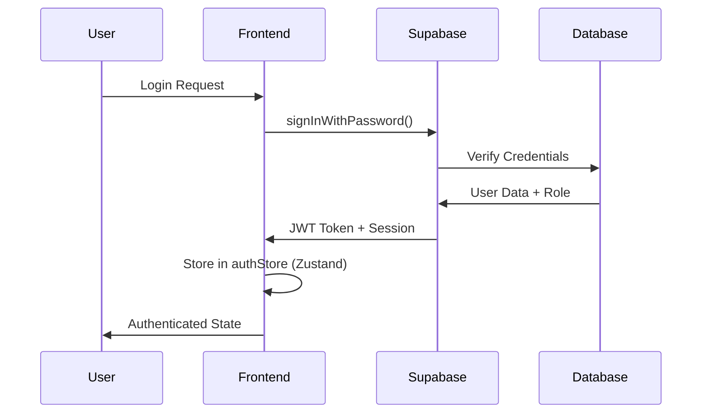

# 🔒 Supabase Güvenlik Rehberi

Bu dokümantasyon, Dernek Yönetim Sistemi'nde kişisel verilerin güvenliğini
sağlamak için uygulanan güvenlik önlemlerini açıklar.

## 📋 İçindekiler

1. [Güvenlik Mimarisi](#1-güvenlik-mimarisi)
2. [Kimlik Doğrulama](#2-kimlik-doğrulama)
3. [Veri Erişim Kontrolü](#3-veri-erişim-kontrolü)
4. [Kişisel Veri Koruma (KVKK)](#4-kişisel-veri-koruma-kvkk)
5. [Audit Logging](#5-audit-logging)
6. [Güvenlik Testleri](#6-güvenlik-testleri)
7. [En İyi Uygulamalar](#7-en-iyi-uygulamalar)

---

## 1. Güvenlik Mimarisi

## Security Implementation

### Client-Side Security Module

The application uses a centralized security module at `lib/security/` which
provides:

- Input sanitization and validation
- CSRF protection
- XSS prevention
- SQL injection prevention
- Security headers

All client-side security features are implemented in this module. **Do not
implement security features elsewhere** to avoid duplication and inconsistency.

### Infrastructure Security

**Supabase provides:**

- Row Level Security (RLS) policies
- JWT-based authentication
- Audit logging via `audit_logs` table
- Database encryption (at-rest and in-transit)
- Rate limiting

**Cloudflare provides:**

- DDoS protection
- Bot management and detection
- Web Application Firewall (WAF)
- Rate limiting at edge
- Global CDN with HTTPS/TLS

### What NOT to Implement

❌ **Client-side request interception** - Cloudflare handles this at edge ❌
**Client-side IP blocking** - Must be server-side ❌ **User behavior
tracking** - Privacy concerns, use analytics instead ❌ **Client-side bot
detection** - Cloudflare Turnstile handles this ❌ **Complex security rules
engine** - Use Supabase RLS policies

### 🏗️ Katmanlı Güvenlik Modeli

```
┌─────────────────────────────────────────┐
│           Frontend (React)              │
│  • JWT Token Authentication            │
│  • Role-based Access Control           │
│  • lib/security/ Module                │
│    - Input Validation & Sanitization   │
│    - CSRF Protection                   │
│    - XSS Prevention                    │
│    - SQL Injection Prevention          │
└─────────────────┬───────────────────────┘
                  │ HTTPS/TLS
┌─────────────────▼───────────────────────┐
│           Supabase Backend              │
│  • Row Level Security (RLS)            │
│  • Database Encryption                 │
│  • Audit Logging (audit_logs table)   │
│  • JWT Auth & Rate Limiting            │
└─────────────────┬───────────────────────┘
                  │
┌─────────────────▼───────────────────────┐
│           Cloudflare Edge               │
│  • DDoS Protection                     │
│  • Bot Management & Detection          │
│  • Web Application Firewall (WAF)      │
│  • Rate Limiting at Edge               │
└─────────────────────────────────────────┘
```

### 🔐 Güvenlik Bileşenleri

- **JWT Authentication**: Supabase Auth ile güvenli kimlik doğrulama
- **Row Level Security (RLS)**: Database seviyesinde erişim kontrolü
- **Role-based Access Control (RBAC)**: Kullanıcı rollerine göre yetkilendirme
- **Audit Logging**: Supabase `audit_logs` tablosunda tüm veri değişikliklerinin
  kaydı
- **Data Encryption**: Veri şifreleme (transport + at-rest)
- **lib/security/ Module**: Merkezi güvenlik modülü - XSS, CSRF, SQL injection
  koruması

---

## 2. Kimlik Doğrulama

### 🔑 Authentication Flow



### 👥 Kullanıcı Rolleri

| Rol          | Yetkiler           | Açıklama             |
| ------------ | ------------------ | -------------------- |
| **admin**    | Tüm işlemler       | Sistem yöneticisi    |
| **manager**  | Yönetim işlemleri  | Departman yöneticisi |
| **operator** | Günlük işlemler    | Operatör             |
| **viewer**   | Sadece görüntüleme | Görüntüleyici        |

### 🛡️ Güvenlik Önlemleri

- **JWT Token Expiration**: 1 saat (otomatik yenileme)
- **Session Management**: Secure session storage
- **Password Policy**: Minimum 8 karakter, karmaşık
- **Rate Limiting**: 5 deneme/15 dakika
- **Account Lockout**: 10 başarısız deneme sonrası

---

## 3. Veri Erişim Kontrolü

### 🗄️ Row Level Security (RLS) Politikaları

#### Beneficiaries Tablosu

```sql
-- Sadece yetkili kullanıcılar görüntüleyebilir
CREATE POLICY "beneficiaries_select_policy" ON public.beneficiaries
  FOR SELECT TO authenticated
  USING (
    EXISTS (
      SELECT 1 FROM public.profiles
      WHERE id = auth.uid()
      AND role IN ('admin', 'manager', 'operator', 'viewer')
    )
  );

-- Sadece admin ve manager ekleyebilir
CREATE POLICY "beneficiaries_insert_policy" ON public.beneficiaries
  FOR INSERT TO authenticated
  WITH CHECK (
    EXISTS (
      SELECT 1 FROM public.profiles
      WHERE id = auth.uid()
      AND role IN ('admin', 'manager')
    )
  );
```

#### Members Tablosu

```sql
-- Tüm yetkili kullanıcılar görüntüleyebilir
CREATE POLICY "members_select_policy" ON public.members
  FOR SELECT TO authenticated
  USING (
    EXISTS (
      SELECT 1 FROM public.profiles
      WHERE id = auth.uid()
      AND role IN ('admin', 'manager', 'operator', 'viewer')
    )
  );
```

### 🔒 Field-level Security

Hassas alanlar için ek koruma:

- **TC No**: Sadece admin ve manager görebilir
- **IBAN**: Sadece admin ve manager görebilir
- **Sağlık Bilgileri**: Sadece admin görebilir

---

## 4. Kişisel Veri Koruma (KVKK)

### 📊 Veri Kategorileri

| Kategori             | Örnekler                  | Koruma Seviyesi |
| -------------------- | ------------------------- | --------------- |
| **Kimlik Bilgileri** | Ad, soyad, TC No          | Yüksek          |
| **İletişim**         | Telefon, email, adres     | Orta            |
| **Sağlık**           | Sağlık durumu, engellilik | Çok Yüksek      |
| **Mali**             | Gelir, IBAN, bağış        | Yüksek          |

### 🔐 Veri Şifreleme

#### Transport Layer Security (TLS)

- Tüm veri iletimi HTTPS üzerinden
- TLS 1.3 kullanımı
- Perfect Forward Secrecy

#### At-Rest Encryption

- Supabase Vault ile hassas alanların şifrelenmesi
- Database seviyesinde şifreleme
- Backup şifreleme

### 🗑️ Veri Silme ve Anonimleştirme

#### Soft Delete

```sql
-- Verileri fiziksel olarak silmek yerine işaretleme
UPDATE beneficiaries
SET status = 'deleted', deleted_at = NOW()
WHERE id = $1;
```

#### GDPR "Right to be Forgotten"

```sql
-- Kişisel verileri anonimleştirme
UPDATE beneficiaries
SET
  name = 'ANONIM',
  surname = 'ANONIM',
  tc_no = NULL,
  phone = NULL,
  email = NULL,
  address = NULL
WHERE id = $1;
```

### ⏰ Veri Saklama Politikaları

- **Aktif Veriler**: 7 yıl
- **Arşiv Veriler**: 10 yıl
- **Silinmiş Veriler**: 30 gün sonra fiziksel silme

---

## 5. Audit Logging

### 📝 Audit Log Tablosu

```sql
CREATE TABLE audit_logs (
  id UUID DEFAULT gen_random_uuid() PRIMARY KEY,
  user_id UUID REFERENCES auth.users(id),
  table_name TEXT NOT NULL,
  operation TEXT NOT NULL, -- INSERT, UPDATE, DELETE, SELECT
  old_values JSONB,
  new_values JSONB,
  ip_address INET,
  user_agent TEXT,
  created_at TIMESTAMP WITH TIME ZONE DEFAULT NOW()
);
```

### 🔍 Loglanan İşlemler

- **Veri Ekleme**: Kim, ne zaman, hangi veriyi ekledi
- **Veri Değiştirme**: Eski ve yeni değerler
- **Veri Silme**: Silinen veri ve silme nedeni
- **Sistem Erişimi**: Login/logout, yetki değişiklikleri

### 📊 Audit Raporları

```sql
-- Son 30 günün aktivite raporu
SELECT
  u.email,
  al.table_name,
  al.operation,
  COUNT(*) as operation_count,
  MAX(al.created_at) as last_activity
FROM audit_logs al
JOIN auth.users u ON al.user_id = u.id
WHERE al.created_at >= NOW() - INTERVAL '30 days'
GROUP BY u.email, al.table_name, al.operation
ORDER BY operation_count DESC;
```

---

## 6. Güvenlik Testleri

### 🧪 Test Senaryoları

#### 1. Authentication Tests

```typescript
describe('Authentication Security', () => {
  test('should reject invalid credentials', async () => {
    const result = await authStore.login('invalid@email.com', 'wrongpassword');
    expect(result.success).toBe(false);
  });

  test('should enforce rate limiting', async () => {
    // 5 başarısız deneme sonrası hesap kilitlenmeli
    for (let i = 0; i < 6; i++) {
      await authStore.login('test@email.com', 'wrongpassword');
    }
    expect(authStore.isLocked).toBe(true);
  });
});
```

#### 2. Authorization Tests

```typescript
describe('Row Level Security', () => {
  test('viewer should not access admin data', async () => {
    const viewerUser = { role: 'viewer' };
    const result = await supabase.from('sensitive_data').select('*');
    expect(result.error).toBeTruthy();
  });
});
```

#### 3. Data Validation Tests

```typescript
describe('Input Validation', () => {
  test('should sanitize user input', () => {
    const maliciousInput = '<script>alert("xss")</script>';
    const sanitized = sanitizeInput(maliciousInput);
    expect(sanitized).not.toContain('<script>');
  });
});
```

---

## 7. En İyi Uygulamalar

### ✅ Güvenlik Checklist

- [ ] **Service Role Key** frontend'de yok
- [ ] **RLS politikaları** tüm tablolarda aktif
- [ ] **Audit logging** tüm kritik işlemlerde
- [ ] **Input validation** tüm formlarda
- [ ] **Rate limiting** authentication'da
- [ ] **HTTPS** tüm iletişimde
- [ ] **Session timeout** uygun sürede
- [ ] **Password policy** güçlü şifreler
- [ ] **Error handling** bilgi sızıntısı yok
- [ ] **Backup encryption** yedekler şifreli

### 🚨 Güvenlik Uyarıları

#### ❌ Yapılmaması Gerekenler

- Service role key'i frontend'de kullanma
- Hassas verileri console.log ile yazdırma
- SQL injection'a açık query'ler
- Client-side validation'a güvenme
- Şifreleri plain text olarak saklama

#### ✅ Yapılması Gerekenler

- Her zaman server-side validation
- RLS politikalarını düzenli kontrol et
- Audit logları düzenli incele
- Güvenlik güncellemelerini takip et
- Penetration test yap

### 🔄 Güvenlik Güncellemeleri

#### Haftalık Kontroller

- [ ] Audit logları incele
- [ ] Başarısız login denemelerini kontrol et
- [ ] Kullanıcı yetkilerini gözden geçir
- [ ] Sistem güncellemelerini kontrol et

#### Aylık Kontroller

- [ ] Güvenlik testleri çalıştır
- [ ] Backup'ları test et
- [ ] Disaster recovery planını gözden geçir
- [ ] Güvenlik eğitimi ver

---

## 📞 Acil Durum Prosedürleri

### 🚨 Güvenlik İhlali Durumunda

1. **Hemen**: Etkilenen hesapları kilitle
2. **1 saat içinde**: Audit logları incele
3. **4 saat içinde**: Müşterileri bilgilendir
4. **24 saat içinde**: Detaylı rapor hazırla
5. **1 hafta içinde**: Güvenlik açığını kapat

### 📋 İletişim Listesi

- **Güvenlik Sorumlusu**: [email]
- **Teknik Ekip**: [email]
- **Yasal Danışman**: [email]
- **KVKK Sorumlusu**: [email]

---

## 📚 Kaynaklar

- [Supabase Security Guide](https://supabase.com/docs/guides/auth/row-level-security)
- [OWASP Top 10](https://owasp.org/www-project-top-ten/)
- [GDPR Compliance Guide](https://gdpr.eu/)
- [KVKK Rehberi](https://kvkk.gov.tr/)

---

**Son Güncelleme**: Aralık 2024 **Versiyon**: 1.0.0 **Güvenlik Seviyesi**:
Yüksek
